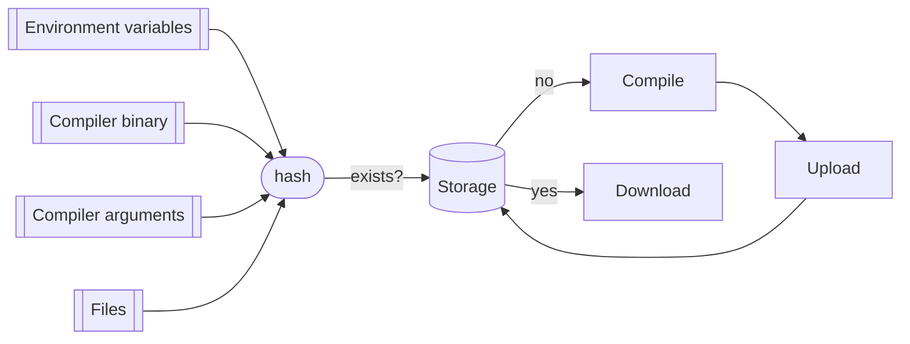

# Sccache high level architecture

This schema shows at high level how sccache works.

```mermaid
  flowchart LR
      id1[[Environment variables]] --> hash
      id2[[Compiler binary]] --> hash
      id3[[Compiler arguments]] --> hash
      id5[[Files]] --> |  | hash
      Compile --> Upload
      Storage[(Storage)] --> | yes | Download
      hash([hash]) --> | exists? | Storage
      Storage --> | no | Compile
      Upload --> Storage
```

For more details about hash generation works, see [the caching documentation](Caching.md).

