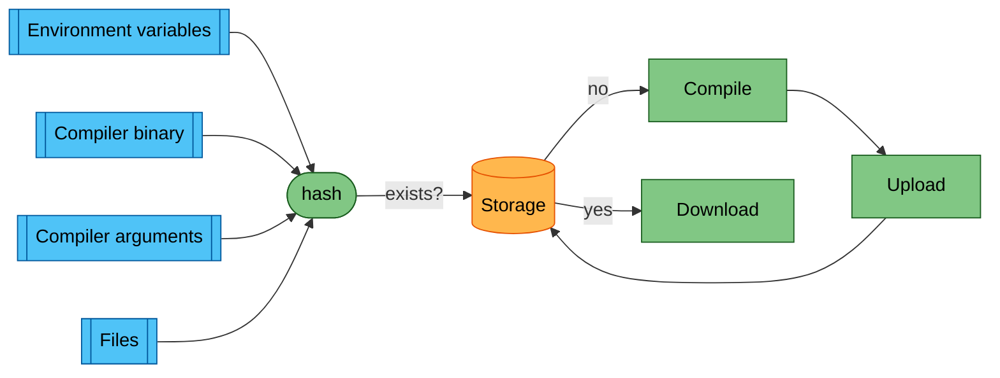
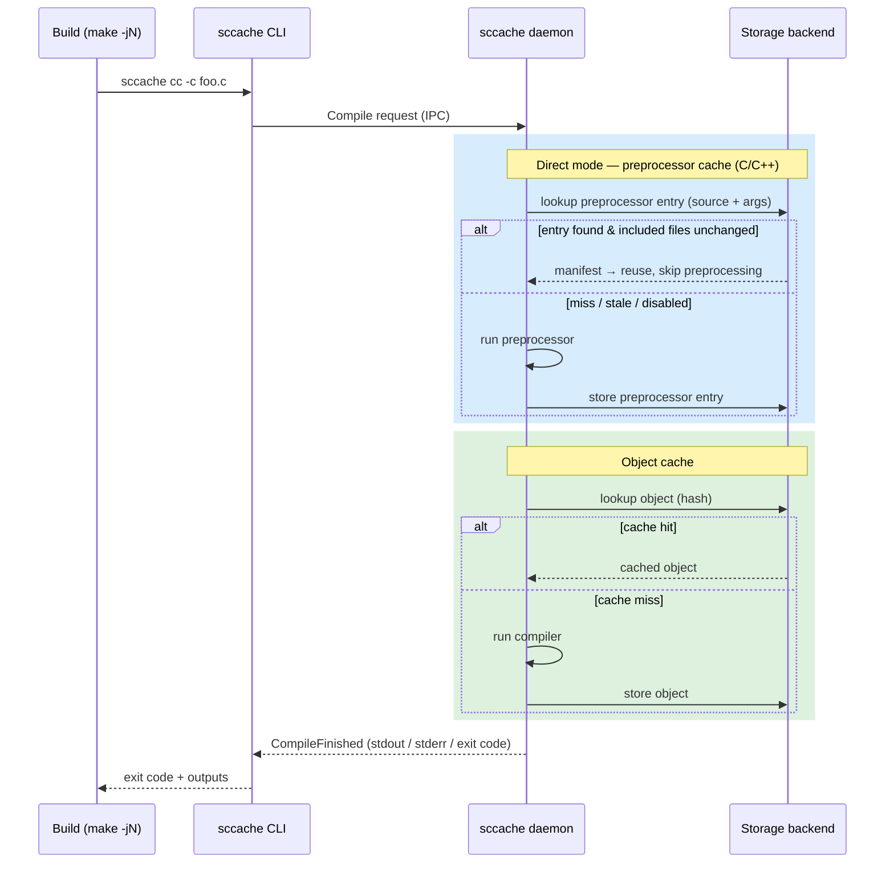
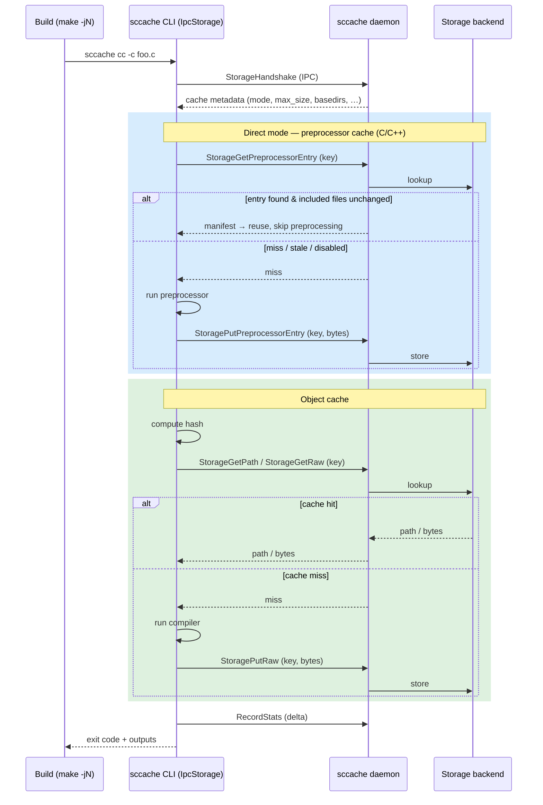

# Sccache high level architecture

This schema shows at a high level how sccache decides whether to compile or to
reuse a cached result.

For more details about how hash generation works, see [the caching documentation](Caching.md).

## Direct mode (preprocessor cache)

For C/C++, sccache can also cache the *preprocessor* result, so that a cache
lookup can skip preprocessing entirely. This is inspired by
[ccache's direct mode](https://ccache.dev/manual/3.7.9.html#_the_direct_mode)
and is described in the [local storage doc](Local.md).

Before computing the object-cache key, sccache looks up a **preprocessor cache
entry** keyed on the source file (path + contents) and the preprocessor
arguments. That entry records every file included by the source. If the entry
exists and all of those included files are unchanged, sccache reuses it and
never runs the preprocessor; otherwise it preprocesses normally and stores a
fresh entry. This step is shown as the blue region in the diagrams below and is
enabled by default (it is skipped for non-C/C++, when disabled, or when certain
flags such as `-Wp,*` / `-Xpreprocessor` are present).

## Execution modes

The caching logic above is the same regardless of *where* it runs. What differs
is which process actually runs the compiler and talks to the storage backend.

sccache is split in two:

- a short-lived **CLI process**, spawned once per compiler invocation (e.g. by
  `make -jN`), and
- a long-lived **daemon** (the background server), which holds the storage
  backend and the accumulated statistics.

The two communicate over a local IPC connection. There are two ways to divide
the work between them.

### Server-side mode (default)

The CLI forwards the whole compilation to the daemon. The daemon runs the
direct-mode preprocessor cache lookup, computes the hash, looks up the object
cache, runs the compiler on a miss, stores the result, and streams the outputs
back to the CLI.

### Client-side mode (`SCCACHE_CLIENT_SIDE`)

The compile pipeline runs **in the CLI process itself**; the daemon is used only
as a shared gateway to the storage backend (and as a place to aggregate stats).

On startup the CLI performs a one-shot `StorageHandshake` to fetch the cache
metadata (cache mode, max size, basedirs, preprocessor-cache config). It then
runs the same pipeline locally — including direct mode — and forwards each
individual cache operation to the daemon over IPC. On the client side this is
implemented by `IpcStorage`, which implements the same `Storage` trait as every
other backend, so the rest of the compile pipeline is unchanged.

`StorageGetPath` lets the CLI read a cached entry straight off disk when the
backend exposes a local path; for backends that don't (S3, Redis, …) the CLI
falls back to fetching the raw bytes with `StorageGetRaw`. Direct-mode entries
are exchanged with `StorageGetPreprocessorEntry` / `StoragePutPreprocessorEntry`.
Because each CLI process accumulates its own statistics, it flushes them to the
daemon with `RecordStats` before exiting.

Client-side mode is enabled with the `SCCACHE_CLIENT_SIDE` environment variable
(or the `client_side_mode` config key). It is currently mutually exclusive with:

- **error logging** (`SCCACHE_ERROR_LOG`): the client always logs to stderr, and
  multiple concurrent CLI processes would race on the log file, and
- **distributed compilation** (a configured scheduler URL).

If either is in use, the setting is ignored and sccache stays in server-side
mode.
