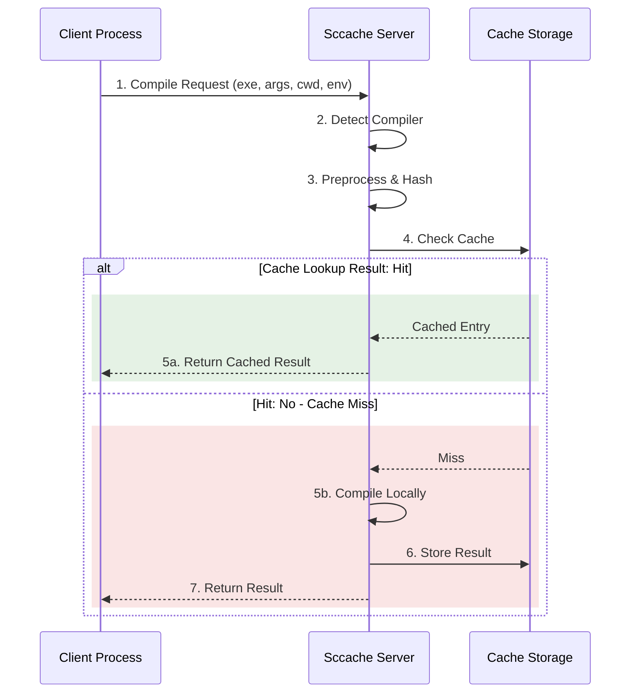
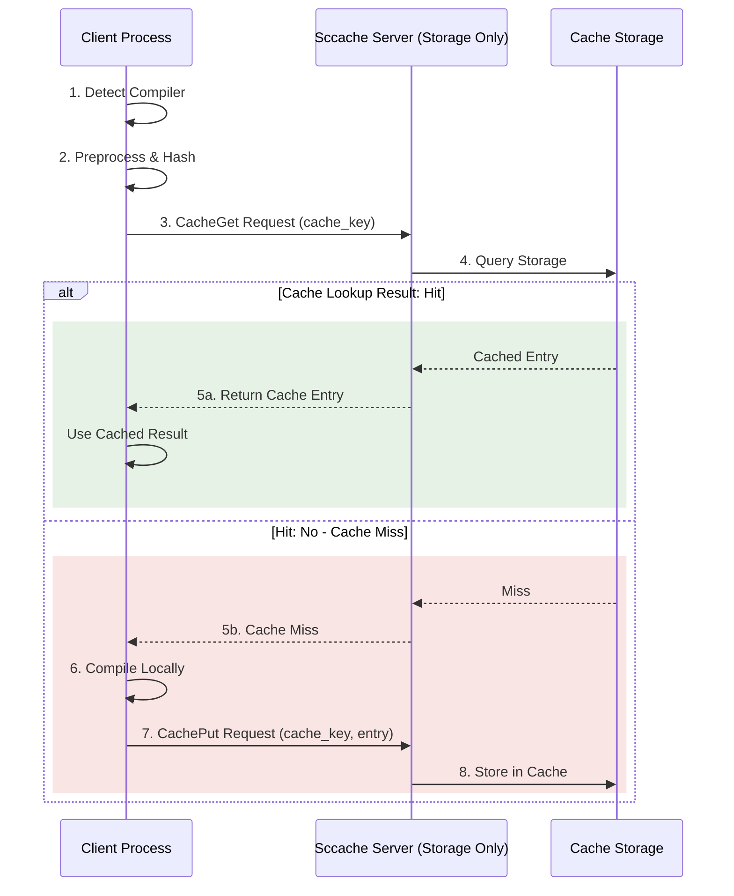
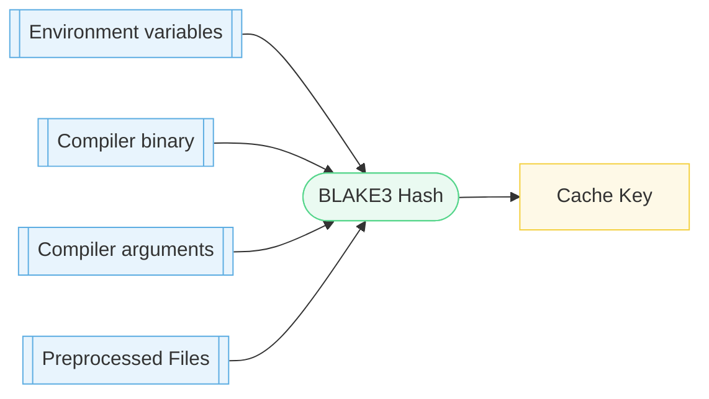

# Sccache high level architecture

Sccache supports two compilation modes: **server-side compilation** (legacy) and **client-side compilation** (new). The mode is controlled by the `SCCACHE_CLIENT_SIDE_COMPILE` environment variable.

## Server-Side Compilation (Legacy Mode)

This is the default mode when `SCCACHE_CLIENT_SIDE_COMPILE` is unset or set to `0`.

In this mode, the server performs all compilation work:

**Characteristics**:
- Server performs compiler detection, preprocessing, hash generation, and compilation
- All work happens on the server machine
- Server can become a bottleneck with many parallel clients
- Higher server CPU and memory usage

## Client-Side Compilation (New Mode)

Enabled by setting `SCCACHE_CLIENT_SIDE_COMPILE=1`.

In this mode, the client performs compilation work and the server acts as pure storage:

**Characteristics**:
- Client performs compiler detection, preprocessing, hash generation, and compilation
- Server only handles cache storage operations (get/put)
- Work is distributed across all clients (better scalability)
- Lower server CPU and memory usage
- Reduced network latency (single request instead of multiple round trips)

**Why this is fast**: preprocessing in client-side mode is cheap — it only concatenates source files rather than running the full C/C++ preprocessor. This avoids the expensive `#include` expansion and macro evaluation that dominates traditional preprocessing time, making it practical to move this work to the client without a performance penalty.

**Note**: Client-side compilation is functional but considered experimental. Enable it by setting `SCCACHE_CLIENT_SIDE_COMPILE=1`.

## Comparison

| Aspect | Server-Side (Legacy) | Client-Side (New) |
|--------|---------------------|-------------------|
| Compiler Detection | Server | Client (with caching) |
| Preprocessing | Server | Client |
| Hash Generation | Server | Client |
| Compilation | Server | Client |
| Server Role | Full compilation service | Pure storage service |
| Server CPU Usage | High | Low |
| Server Memory Usage | Moderate | Low |
| Client Overhead | Low | Moderate |
| Scalability | Limited by server | Excellent |
| Network Requests | Multiple round trips | Single request |

## Cache Key Generation

Regardless of the mode, cache keys are generated from:

### C/C++ vs Rust

The "preprocessing" step differs significantly between languages:

- **C/C++**: runs the compiler's preprocessor (`gcc -E` / `clang -E`) to expand all `#include` directives and macros, producing a single translation unit. The preprocessed output is then hashed. This is the expensive part — include expansion can pull in thousands of header files.

- **Rust**: there is no preprocessor. Instead, sccache runs `rustc --emit dep-info`, a lightweight invocation that outputs a `.d` file listing all source files and environment variables the crate depends on — without compiling anything. Sccache then hashes each source file individually, along with extern crate `.rlib` files, static libraries, and any target JSON file. This dependency discovery step is fast compared to full compilation.

In client-side mode, this work moves to the client. For Rust, the cost is minimal since `--emit dep-info` is cheap. For C/C++, preprocessing is replaced by simple file concatenation, avoiding the expensive include expansion entirely.

For more details about how hash generation works, see [the caching documentation](Caching.md).

## Protocol

### Server-Side Mode Protocol

- **Request**: `Compile(Compile)` - Contains executable path, arguments, working directory, environment variables
- **Response**: `CompileFinished(CompileFinished)` - Contains exit code, stdout, stderr, and output file paths

### Client-Side Mode Protocol

- **Request**: `CacheGet(CacheGetRequest)` - Contains cache key
- **Response**: `CacheGetResponse::Hit(Vec<u8>)` - Cache entry as bytes
- **Response**: `CacheGetResponse::Miss` - Cache miss
- **Request**: `CachePut(CachePutRequest)` - Contains cache key and entry bytes
- **Response**: `CachePutResponse(Duration)` - Storage duration

The protocol supports version negotiation to maintain backward compatibility during migration from server-side to client-side mode.

## Storage Backends

Both modes use the same cache storage backends:

- **Local Disk** (`SCCACHE_DIR`)
- **S3 Compatible** (`SCCACHE_BUCKET`, `SCCACHE_ENDPOINT`)
- **Redis** (`SCCACHE_REDIS_ENDPOINT`)
- **Memcached** (`SCCACHE_MEMCACHED_ENDPOINT`)
- **Google Cloud Storage** (`SCCACHE_GCS_BUCKET`)
- **Azure Blob Storage** (`SCCACHE_AZURE_CONNECTION_STRING`)
- **GitHub Actions Cache** (`SCCACHE_GHA_CACHE_URL`)
- **WebDAV** (`SCCACHE_WEBDAV_ENDPOINT`)
- **Alibaba Cloud OSS** (`SCCACHE_OSS_BUCKET`)
- **Tencent Cloud COS** (`SCCACHE_COS_BUCKET`)

See [Configuration.md](Configuration.md) for storage backend configuration details.

